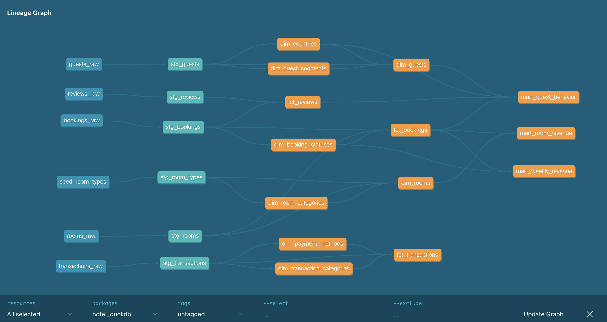

# Hotel Data Warehouse (dbt + DuckDB)

---

### Project overview
This project transforms raw hotel operations data into a structured Star Schema data warehouse using dbt (Data Build Tool) and DuckDB. It covers the entire lifecycle of hotel data—from guest profiles and room management to bookings, transactions, and customer reviews.

---

### Key Features
Incremental Modeling: 5+ core models use incremental materialization for efficient data processing.

Data Quality: Includes automated dbt tests for primary keys, foreign key relationships, and custom business logic (e.g., check-out must be after check-in).

Automated Cleaning: Custom macro for text standardization across all source files.

---

### Raw Layer (`seeds` folder)
I generated 6 data sources:

- bookings_raw.csv - info about bookings and their statuses
- transactions_raw.csv - info about transactions
- reviews_raw.csv - selection of reviews
- guests_raw.csv - information about guests
- rooms_raw.csv - information about guests, including their types
- seed_room_types.csv - a seed with more detailed info about each of the types of the rooms

### Stage Layer (`models/staging` folder)
This layer has 6 models with cleaned and properly typed data:
stg_bookings.sql, stg_transactions.sql, stg_reviews.sql, stg_guests.sql, stg_rooms.sql, stg_room_types.sql.

### Mart Layer (`models/mart` folder)
This layer has 14 models:
- 11 core models:
    - 8 dimentions
    - 3 fact tables
- 3 analytical models with business-specific insights:
mart_guest_behaviour.sql, mart_room_revenue.sql, mart_weekly_revenue.sql.

---

### Lineage graph

